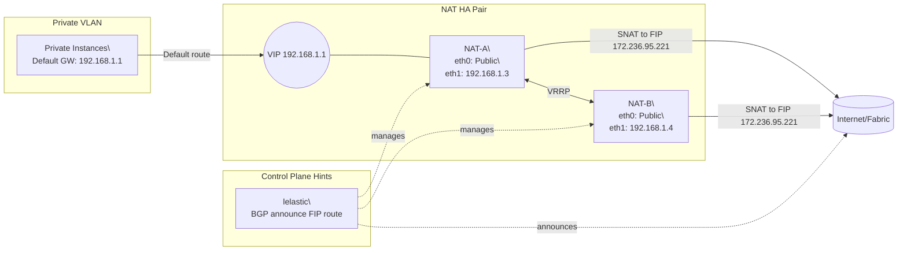
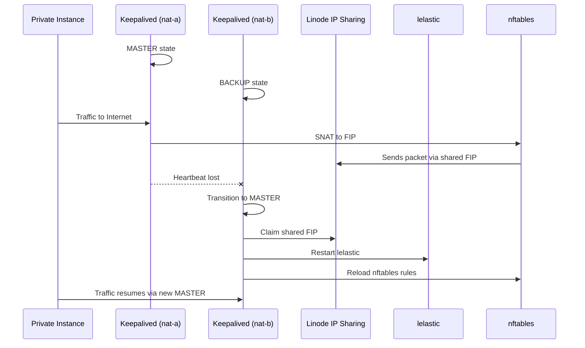

# 🏗️ Architecture Overview

This document provides a deep-dive into the architecture of the **Linode NAT Gateway (High Availability)** solution, which combines Linode IP Sharing, Keepalived (VRRP), nftables (SNAT), and lelastic (BGP routing helper) to create a fault-tolerant and cost-efficient NAT gateway.

---

## 🌐 High-Level Design

At its core, this setup uses **two Linode instances** (`nat-a` and `nat-b`) that form an **active/standby pair** connected to both:
- A **public interface (eth0)** — connected to the Linode public network  
- A **private VLAN interface (eth1)** — connected to the 192.168.1.0/24 subnet for internal workloads  

### 🎯 Objectives
- Provide **outbound internet access** for private VLAN instances.  
- Ensure **automatic failover** of both private and public IPs.  
- Maintain **persistent session flow** during transitions.  
- Deliver a fully **self-managed and transparent** NAT system (no vendor lock-in).  

---

## 🧩 Components

| Component | Role | Key Functionality |
|------------|------|-------------------|
| **Keepalived (VRRP)** | Heartbeat and failover management | Controls which node is MASTER/BACKUP; assigns/removes VLAN VIP (192.168.1.1/24) |
| **Linode IP Sharing (FIP)** | Floating Public IP | Ensures the shared FIP (e.g. 172.236.95.221) moves to the MASTER node for outbound traffic |
| **nftables (SNAT)** | Packet translation | Performs SNAT from private subnet → public FIP |
| **lelastic** | Lightweight BGP helper | Advertises routes dynamically, supports upstream route refresh |
| **notify.sh hook** | Automation glue | Called by Keepalived on state transitions to reconfigure FIP and restart lelastic |

---

## 🖥️ Network Diagram



---

## ⚙️ Packet Flow Summary

NORMAL OPERATION  
----------------  
- Private instance → Default route (192.168.1.1)  
- MASTER (nat-a) handles SNAT:  
  `ip saddr 192.168.1.0/24 oifname "eth0" snat to 172.236.95.221`  
- Outbound packets go via eth0 → Internet.  

FAILOVER SCENARIO  
-----------------  
- If nat-a fails:  
  - nat-b becomes MASTER via VRRP.  
  - Claims VIP 192.168.1.1 and FIP 172.236.95.221.  
  - lelastic restarts and re-advertises routes.  
  - Outbound traffic resumes via nat-b.  

---

## 🧮 Routing Tables Example

MASTER  
```
default via <Linode GW> dev eth0
192.168.1.0/24 dev eth1  proto kernel  scope link  src 192.168.1.3
```

BACKUP  
```
default via <Linode GW> dev eth0
192.168.1.0/24 dev eth1  proto kernel  scope link  src 192.168.1.4
```

---

## 🧩 Failover Logic Flow



---

## 🔁 State Transition Summary

| State | Responsible Node | Active IPs | Action |
|--------|------------------|-------------|--------|
| MASTER | `nat-a` | VLAN VIP + FIP | Handles all NAT + BGP |
| BACKUP | `nat-b` | VLAN IP only | Monitors VRRP state |
| FAILOVER | `nat-b` | Claims both | Takes over automatically |
| RECOVERY | `nat-a` | Resyncs | Rejoins as BACKUP |

---

## 🔍 Key Takeaways

- Fully self-managed NAT solution.  
- Leverages **standard Linux networking** primitives.  
- Recoverable within **<3 seconds** in failover scenarios.  
- Integrates with Linode’s **IP Sharing** API natively.  

---

Next doc 👉 [Failure Scenarios & Recovery Behavior](https://github.com/sandipgangdhar/linode-nat-gateway/blob/feature/nat-gateway/docs/failure-scenarios.md)
