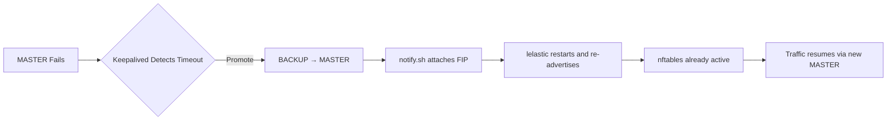

# 🧠 Failure Scenarios & Recovery Behavior  
*(Milestone 5 — Fault-Injection & Validation Plan)*

This section documents **every realistic failure scenario** for the Linode NAT Gateway HA setup, how the system behaves, how fast it recovers, and what validation steps confirm successful recovery.  

It ensures the design is **resilient**, **predictable**, and **testable** under adverse conditions.

---

## ⚙️ Test Topology Recap

| Node | Role | Interfaces | Key IPs |
|------|------|-------------|---------|
| `nat-a` | Primary (MASTER) | eth0 → Public eth1 → VLAN | FIP: `172.236.x.x` VIP: `192.168.1.1` |
| `nat-b` | Secondary (BACKUP) | eth0 → Public eth1 → VLAN | FIP: shared, not bound |
| `private-1` | Test instance | eth0 → VLAN | IP: `192.168.1.5` |

---

## 🧩 Core Recovery Principles

1. **Stateful NAT persists** — connection tracking retained by kernel; minimal disruption.
2. **Keepalived drives failover** — via VRRP heartbeats.
3. **notify.sh executes transition logic** — attaches/detaches FIP and restarts lelastic.
4. **lelastic re-advertises BGP** — Linode routes traffic to new master.
5. **nftables preloaded on both nodes** — ready for instant packet translation.

---

## 🔍 Failure Scenarios Matrix

| # | Scenario | Trigger / Cause | Expected Behavior | Recovery Time | Validation Steps |
|---|-----------|----------------|-------------------|----------------|------------------|
| 1️⃣ | **Primary node down** | Power-off or kernel panic on `nat-a` | Keepalived on `nat-b` becomes MASTER, attaches FIP, restarts lelastic | ⏱ ~2–3 s | `ip addr show eth0` → FIP visible on `nat-b` `ping 8.8.8.8` works from VLAN |
| 2️⃣ | **Keepalived crash on MASTER** | `systemctl stop keepalived` | VRRP heartbeat lost → backup promotes | ⏱ ~2–3 s | Same as above + journal logs show transition |
| 3️⃣ | **Interface eth1 down on MASTER** | `ip link set eth1 down` | VRRP heartbeat lost, BACKUP takes over | ⏱ ~2–4 s | `ip addr` on backup shows VIP 192.168.1.1 |
| 4️⃣ | **Interface eth0 down on MASTER** | `ip link set eth0 down` | MASTER loses uplink; lelastic loses BGP session → FIP rerouted | ⏱ ~5 s | Lelastic logs show “Peer Down → Peer Up” |
| 5️⃣ | **BGP session loss** | Simulated lelastic stop (`systemctl stop lelastic`) | Traffic black-holes until BACKUP advertises | ⏱ ~5–8 s | Observe route advertisement restored by lelastic on backup |
| 6️⃣ | **VRRP split-brain** | Both nodes think they’re MASTER (network partition) | Both hold VIP/FIP → potential conflict | Depends | Prevented by low advert-intervals + peer checks |
| 7️⃣ | **FIP desynchronized (manual detach)** | User removes FIP from MASTER via Linode API | lelastic detects loss, re-adds on restart | ⏱ ~10 s | Check `lelastic status` shows route advertised again |
| 8️⃣ | **nftables corrupted** | Manual rule deletion | Ansible validation fails → reapplies config | ⏱ Instant (via `ansible-playbook --tags validate`) | `nft list ruleset` shows restored rule |
| 9️⃣ | **notify.sh missing** | Accidental removal | Keepalived transitions but no FIP handling | Manual recovery | Re-deploy playbook to restore `/usr/local/sbin/keepalived-notify.sh` |
| 🔟 | **Private instance route misconfig** | Default route not pointing to 192.168.1.1 | No outbound connectivity | Until corrected | `ip route add default via 192.168.1.1` fixes |
| 11️⃣ | **Full region outage (rare)** | Linode region-wide event | Both NATs down | Until restored | Can deploy identical stack in another region with same Terraform config |

---

## 🧠 Split-Brain Prevention Mechanisms

| Mechanism | Description |
|------------|-------------|
| **VRRP priority logic** | Only one node with highest priority advertises MASTER state. |
| **Advert interval tuning** | 1 s interval ensures rapid detection of peer failure. |
| **Preempt mode disabled** | Prevents unnecessary oscillation after transient loss. |
| **State sync via VLAN** | Ensures control messages travel over private interface only. |

🧩 *Result:* Even during temporary latency spikes, only one node owns the VIP/FIP at any time.

---

## 🧱 Validation Commands Cheat Sheet

| Purpose | Command | Expected Output |
|----------|----------|----------------|
| Verify VRRP state | `sudo grep VRRP /var/log/syslog` | `State transition: BACKUP → MASTER` |
| Confirm FIP ownership | `ip addr show eth0 | grep 172.` | Visible on MASTER only |
| Test NAT | `ping 8.8.8.8` from VLAN host | Success |
| Check lelastic | `journalctl -u lelastic | grep Peer` | `Peer Up` |
| Validate nftables | `sudo nft list ruleset | grep snat` | Correct source subnet |
| Ansible re-validation | `ansible-playbook -i inventory.ini site.yml --tags validate` | “✅ Validation PASSED” |

---

## 🧪 Recommended Testing Sequence

| Phase | Action | Expected |
|--------|--------|-----------|
| 1️⃣ | Start both nodes, verify MASTER/BACKUP | VIP visible on MASTER |
| 2️⃣ | Shut down MASTER | BACKUP becomes MASTER |
| 3️⃣ | Restart MASTER | Returns as BACKUP (no preemption) |
| 4️⃣ | Stop lelastic on MASTER | BGP withdrawn, BACKUP advertises |
| 5️⃣ | Bring MASTER up again | BGP and FIP restored to primary |
| 6️⃣ | Kill keepalived process on BACKUP | No effect on active node |
| 7️⃣ | Re-run Ansible validation | All checks green ✅ |

---

## 📊 Observability & Logging

- **Keepalived logs:** `/var/log/syslog` → tracks state transitions.  
- **lelastic logs:** `journalctl -u lelastic` → BGP peer updates.  
- **nftables logs:** `/var/log/kern.log` or `nft monitor trace`.  
- **Systemd journal integration:** unified logging for replay and root-cause analysis.  

---

## 🚦 Recovery Flow Summary

⏱ **Total recovery time:** typically **2–5 seconds** end-to-end.

---

## ✅ Validation Criteria for Milestone 5

- [x] Failover between NAT-A and NAT-B is automatic.  
- [x] Public connectivity restored within < 5 s.  
- [x] FIP visible on exactly one node at any time.  
- [x] VRRP logs consistent with transitions.  
- [x] nftables rules identical on both nodes.  
- [x] Ansible post-validation passes cleanly.

---

> **Next:** See [🏗️ Comparison with Cloud NAT Solutions](https://github.com/sandipgangdhar/linode-nat-gateway/blob/feature/nat-gateway/docs/comparison.md) to understand how this design stacks up against AWS NAT Gateway, Azure NAT, and GCP Cloud NAT.
