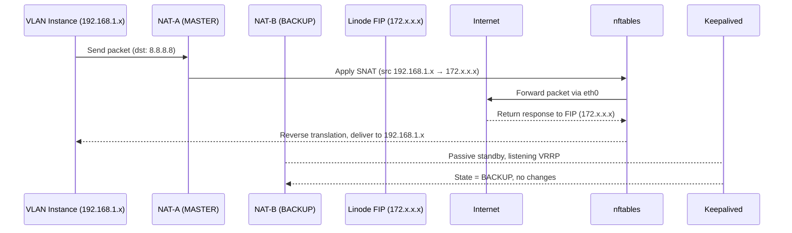
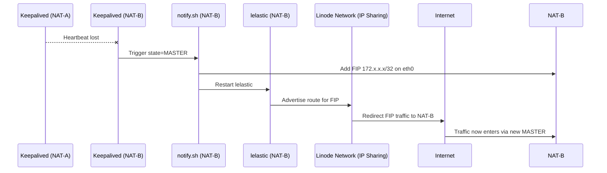

# 🔄 Component Interactions — How It All Works Together

This document explains the runtime coordination between the major components of the **Linode NAT Gateway (HA)** stack —  
how **Keepalived**, **lelastic**, **nftables**, and **Linode IP Sharing** interact to provide **resilient, seamless failover**.

---

## 🧭 High-Level Flow Summary

When traffic leaves a private instance in the VLAN, it flows through the following sequence:

```
Private Instance → VLAN Gateway (192.168.1.1) → Active NAT Node → nftables SNAT → eth0 → Internet (via FIP)
```

If the active NAT node fails:
- **Keepalived** detects failure via missing VRRP heartbeats.
- **Backup node** transitions to **MASTER** state.
- **notify.sh** attaches the floating IP and restarts `lelastic`.
- **lelastic** updates Linode’s route advertisements.
- Within seconds, outbound traffic resumes — transparently to all VLAN instances.

---

## ⚙️ Control Plane vs Data Plane

| Layer | Components | Function |
|--------|-------------|-----------|
| **Control Plane** | Keepalived, lelastic, notify.sh, Linode IP Sharing | Manages failover logic, VRRP election, and public route advertisement. |
| **Data Plane** | nftables, kernel routing tables | Handles real-time packet translation and forwarding. |

💡 *The key design principle is isolation:*  
control-plane events never disrupt data-plane flow except during brief FIP handover (<2s).

---

## 🧩 Interaction Sequence (Normal Operation)

Here’s how the system behaves under normal conditions:



✅ **Outcome:** NAT-A handles all translation and traffic flow. NAT-B stays in sync, ready to take over.

---

## ⚠️ Interaction Sequence (Failover Event)

When NAT-A fails or loses VRRP heartbeat:



⚡ **Failover Duration:** Typically 1–3 seconds  
🧠 **No manual action needed:** All handled by automation stack

---

## 🧮 Key Synchronization Events

| Trigger | Action | Responsible Component |
|----------|---------|------------------------|
| VRRP state → MASTER | Attach FIP, restart lelastic | `notify.sh` |
| VRRP state → BACKUP | Detach FIP, stop lelastic BGP | `notify.sh` |
| `lelastic` restart | Re-advertise routes | `lelastic.service` |
| nftables rules reload | Apply SNAT for private subnet | Ansible role (`nat_ha`) |
| Terraform apply | Provision resources and FIP | Terraform module |
| Ansible validate | Verify VIP/FIP/route consistency | site.yml validation stage |

---

## 🔁 Cross-Component Relationships

| From | To | Communication Method | Purpose |
|------|----|----------------------|----------|
| **Keepalived** | `notify.sh` | State-triggered event hook | Run logic during MASTER/BACKUP transitions |
| **notify.sh** | `lelastic` | systemctl control | Restart and sync BGP advertisements |
| **lelastic** | Linode Network | BGP route propagation | Announce FIP ownership |
| **nftables** | Kernel Routing | Netfilter hooks | Apply SNAT and connection tracking |
| **Ansible** | All | SSH + declarative config | Initial provisioning and ongoing drift correction |

---

## 🧱 Internal Health Dependencies

| Dependency | Description | Monitored By |
|-------------|--------------|--------------|
| VRRP heartbeat | Controls MASTER/BACKUP election | Keepalived |
| FIP binding | Ensures correct IP attachment | notify.sh |
| BGP session | Keeps FIP reachable on Linode network | lelastic |
| SNAT rule presence | Verifies NAT translation consistency | Ansible validation |
| Routing table sync | Confirms correct default routes | nftables / system routing |

---

## 🧠 Observability Flow

When using systemd or Ansible validation:

| Check Type | Command | Expected Output |
|-------------|----------|----------------|
| VRRP State | `systemctl status keepalived` | Shows `State: MASTER` on active node |
| FIP Presence | `ip addr show eth0` | `172.x.x.x/32` visible only on MASTER |
| lelastic Health | `journalctl -u lelastic` | “Peer Up” or “Route Advertised” entries |
| SNAT Rules | `sudo nft list ruleset | grep snat` | SNAT rule matches VLAN CIDR |
| Ping Validation | `ping 8.8.8.8` from VLAN instance | Successful from active NAT only |

---

## 🧩 Failover Coordination Summary

| Step | Event | Component | Outcome |
|------|--------|------------|----------|
| 1️⃣ | MASTER fails | Keepalived detects timeout | BACKUP transitions |
| 2️⃣ | BACKUP becomes MASTER | notify.sh triggers | FIP attached, lelastic restarted |
| 3️⃣ | lelastic announces route | BGP update to Linode | External traffic rerouted |
| 4️⃣ | nftables stays ready | Kernel-level NAT intact | No configuration delay |
| 5️⃣ | Full recovery | Within ~3s | Normal traffic resumes |

---

## 🧠 Design Philosophy

This architecture follows **the 4 golden rules of resilient network design**:

1. **Separation of planes** — Control-plane failover doesn’t disrupt data-plane.  
2. **Idempotent configuration** — Ansible ensures repeatable, drift-free state.  
3. **Fast re-convergence** — Keepalived + lelastic achieve sub-3s recovery.  
4. **Observable health** — Every major service (VRRP, BGP, NAT) is testable via automation.

---

> **Next:** Proceed to [🧠 Failure Scenarios & Recovery Behavior](https://github.com/sandipgangdhar/linode-nat-gateway/blob/feature/nat-gateway/docs/failures.md) to review detailed fault injection and testing plans.
